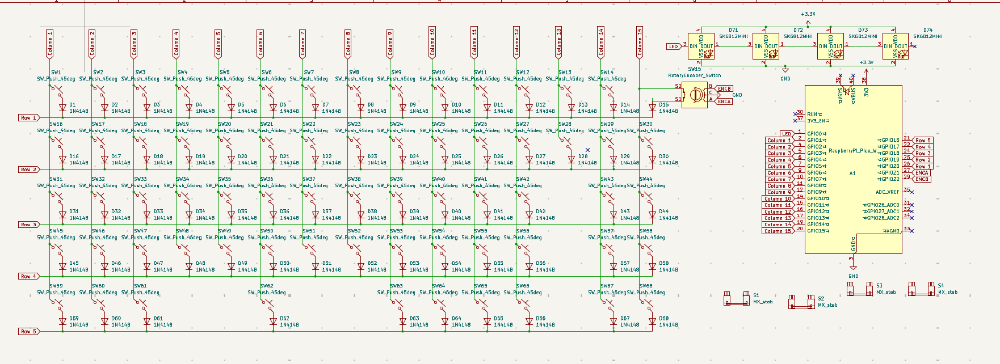

**Total Total time spent: 14h**

### Day 1 | 6/29 | PCB Pain
- Did a heck ton of research on what a mechanical keyboard is + components
- asked around in #highway for help on part sourcing: decided on Akko Penguins on 65%
- Started schematic (14x5 + 1 rotary encoder + pico) + pcb work
- Realized my routing is messy and restarted, then realized that it could be much simpler with better schematic wiring
    - Changed to 15x5 and removed some switches for bigger keys

    - Then realized that the numbering mechanism for kbplacer got messed up because of it :sob:
- Overall, I learned and set my goals!

**Total hours spent: 5h**

### Day 2 | 6/30 | Fresh Start!
- Restarted the switches matrix so the numbering would be fixed!

- Routed correctly this time

- Spent an unhealthy amount of time navigating KiCad to find where to add 3D Models :(

- More research + BOM making

**Total hours spent: 5h** 

### Day 3 | 7/1 | Hopefully almost done!
- Double checked PCB
- Learning Fusion360! It's my first time, and I have only used SolidWorks and Onshape before
    - I realize that I dislike fusion, it is so slow!

**Total hours spent: 1h**

### Day 4 | 7/2 | Finished!
- Finished the case! I plan to use heat set inserts so screwing in the PCB would be easier

**Total hours spent: 1h**

### Day 5 | 7/4 | Commits...
- Organized files + wrote stuff
- Spent a sad amount of time learning git and almost breaking stuff...
- Firmware through ai

**Total hours spent: 1h**

### Day 6 | 7/6 | Fixes!
- Committed fixes needed for re-review!
    - Added top to case
    
**Total hours spent: 1h**