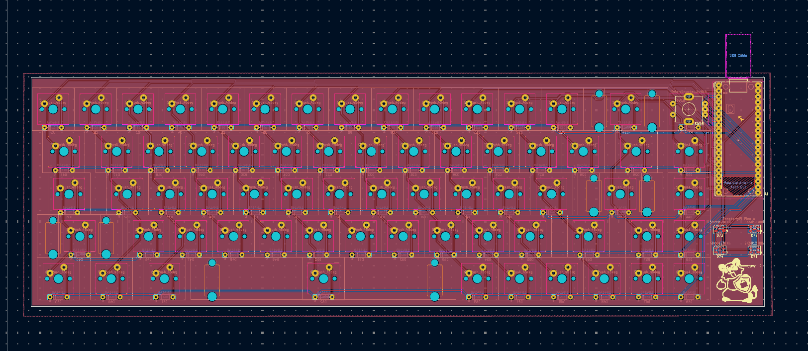
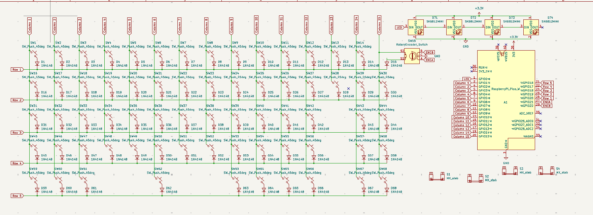

# This is a Keyboard!

## Description
This is a 65% keyboard that I made to learn more about PCB design & keyboard making! It uses a Raspberry Pi Pico as its microcontroller and I plan to use Akko Penguin switches. On the bottom right of the PCB, there is artwork by [bunnyguy](https://bunnyguy.foo/)!

## Why I Made This
I need a keyboard, and I need to learn pcb design + F360, so why not fulfill both? I also thought this was a fun project, and I learned a lot from researching keyboard components and design! I guess this is a part 2 to the hackpad I made a week earlier.

## Pictures

## BOM
| name        | qty  | price  | link                                                                                                                                                                                                                                                                                                                                                                                                                                                                                                                                                                                                                                                                                                                                                                                                                                                                                                                                                                                                                                                                                                                                                                                                                                                                                                                             | notes                 |
| ----------- | ---- | ------ | -------------------------------------------------------------------------------------------------------------------------------------------------------------------------------------------------------------------------------------------------------------------------------------------------------------------------------------------------------------------------------------------------------------------------------------------------------------------------------------------------------------------------------------------------------------------------------------------------------------------------------------------------------------------------------------------------------------------------------------------------------------------------------------------------------------------------------------------------------------------------------------------------------------------------------------------------------------------------------------------------------------------------------------------------------------------------------------------------------------------------------------------------------------------------------------------------------------------------------------------------------------------------------------------------------------------------------- | --------------------- |
| switches    | 2    | 37.98  | [https://www.amazon.com/dp/B0CJY7QN11?maas=maas_adg_38AB58FC53054C4DAC1A347FC7689420_afap_abs&ref_=aa_maas&tag=maas&th=1](https://www.amazon.com/dp/B0CJY7QN11?maas=maas_adg_38AB58FC53054C4DAC1A347FC7689420_afap_abs&ref_=aa_maas&tag=maas&th=1)                                                                                                                                                                                                                                                                                                                                                                                                                                                                                                                                                                                                                                                                                                                                                                                                                                                                                                                                                                                                                                                                               | awesome-mx style      |
| keycaps     | 1    | 20.5   | [https://www.amazon.com/Rainy75-Gradient-Minimalist-Keyboard-Mechanical/dp/B0F5GLMNFS/ref=sxin_27_sbv_search_btf?content-id=amzn1.sym.c8b39f81-ded8-4d75-80c2-6dfa03cbb699%3Aamzn1.sym.c8b39f81-ded8-4d75-80c2-6dfa03cbb699&crid=1MPSXUA5GTUUT&cv_ct_cx=mx%2Bkeycaps%2Bstandard&keywords=mx%2Bkeycaps%2Bstandard&pd_rd_i=B0F5GLMNFS&pd_rd_r=6bb2a6d4-8e5f-4363-8c05-bd323af9282f&pd_rd_w=U4W2a&pd_rd_wg=DZ6HA&pf_rd_p=c8b39f81-ded8-4d75-80c2-6dfa03cbb699&pf_rd_r=G60E95XXVJ1RECAN13DM&qid=1751361425&s=electronics&sbo=RZvfv%2F%2FHxDF%2BO5021pAnSA%3D%3D&sprefix=mx%2Bkeycaps%2Bstandar%2Celectronics%2C154&sr=1-1-5190daf0-67e3-427c-bea6-c72c1df98776&th=1](https://www.amazon.com/Rainy75-Gradient-Minimalist-Keyboard-Mechanical/dp/B0F5GLMNFS/ref=sxin_27_sbv_search_btf?content-id=amzn1.sym.c8b39f81-ded8-4d75-80c2-6dfa03cbb699%3Aamzn1.sym.c8b39f81-ded8-4d75-80c2-6dfa03cbb699&crid=1MPSXUA5GTUUT&cv_ct_cx=mx%2Bkeycaps%2Bstandard&keywords=mx%2Bkeycaps%2Bstandard&pd_rd_i=B0F5GLMNFS&pd_rd_r=6bb2a6d4-8e5f-4363-8c05-bd323af9282f&pd_rd_w=U4W2a&pd_rd_wg=DZ6HA&pf_rd_p=c8b39f81-ded8-4d75-80c2-6dfa03cbb699&pf_rd_r=G60E95XXVJ1RECAN13DM&qid=1751361425&s=electronics&sbo=RZvfv%2F%2FHxDF%2BO5021pAnSA%3D%3D&sprefix=mx%2Bkeycaps%2Bstandar%2Celectronics%2C154&sr=1-1-5190daf0-67e3-427c-bea6-c72c1df98776&th=1) | idk if these work     |
| diodes      | 1    | 5.99   | [https://www.amazon.com/BOJACK-Switching-IN4148-Electronic-Silicon/dp/B07Q4F3Y5W/ref=cm_cr_arp_d_product_top?ie=UTF8](https://www.amazon.com/BOJACK-Switching-IN4148-Electronic-Silicon/dp/B07Q4F3Y5W/ref=cm_cr_arp_d_product_top?ie=UTF8)                                                                                                                                                                                                                                                                                                                                                                                                                                                                                                                                                                                                                                                                                                                                                                                                                                                                                                                                                                                                                                                                                       | first thing popped up |
| board       | 1    | 7.65   | [https://www.digikey.com/en/products/detail/raspberry-pi/SC0918/16627943?gad_source=1&gad_campaignid=20243136172&gbraid=0AAAAADrbLljqW2QWpgmscmTSfeevh5DOv&gclid=Cj0KCQjwyIPDBhDBARIsAHJyyVjjgVDa1KPtyNgtH46oeAumVBSg4IbVCXbjPDwcXYAMfWDoawfxVWUaAt6oEALw_wcB&gclsrc=aw.ds](https://www.digikey.com/en/products/detail/raspberry-pi/SC0918/16627943?gad_source=1&gad_campaignid=20243136172&gbraid=0AAAAADrbLljqW2QWpgmscmTSfeevh5DOv&gclid=Cj0KCQjwyIPDBhDBARIsAHJyyVjjgVDa1KPtyNgtH46oeAumVBSg4IbVCXbjPDwcXYAMfWDoawfxVWUaAt6oEALw_wcB&gclsrc=aw.ds)                                                                                                                                                                                                                                                                                                                                                                                                                                                                                                                                                                                                                                                                                                                                                                           | i think this works    |
| fasteners   | 1    | 9.99   | [https://www.amazon.com/Mywish-Assortment-Stainless-Washers-Wrenche/dp/B0CQQS6STL/ref=sr_1_1_sspa?crid=28SX9XPKU20Q5&dib=eyJ2IjoiMSJ9.dwMblmjxEM9g5HSlEHTddXwVbNEtfIn39mfrWtbe3HEbGWmOpW4nlDGtvjnjUv9lBxON0qfRkqmoCeSFer8UVdyNSpRJWoSjT_lB-2jdiF84ZWBCjpUT8PmkMZyjIyfCbAbFSz7_H3Xv4k2vzIkE7tNEAp1dFILJ9rmj6z9wVtyY1Kh9jt1CyzN8PC_FDJp-wBZtEYo6En2GEzTkSw7FSRCpVCxhf98cmC80X7Ev_rk.X8m8y9LwbooWOW68bzW6-jQ37i08Cq4CkPq6l52Qn8o&dib_tag=se&keywords=nut%2Band%2Bbolt%2Bset%2Bm3%2Bm4&qid=1751223767&sprefix=nut%2Band%2Bbolt%2Bset%2Bm3%2Bm4%2Caps%2C147&sr=8-1-spons&sp_csd=d2lkZ2V0TmFtZT1zcF9hdGY&th=1](https://www.amazon.com/Mywish-Assortment-Stainless-Washers-Wrenche/dp/B0CQQS6STL/ref=sr_1_1_sspa?crid=28SX9XPKU20Q5&dib=eyJ2IjoiMSJ9.dwMblmjxEM9g5HSlEHTddXwVbNEtfIn39mfrWtbe3HEbGWmOpW4nlDGtvjnjUv9lBxON0qfRkqmoCeSFer8UVdyNSpRJWoSjT_lB-2jdiF84ZWBCjpUT8PmkMZyjIyfCbAbFSz7_H3Xv4k2vzIkE7tNEAp1dFILJ9rmj6z9wVtyY1Kh9jt1CyzN8PC_FDJp-wBZtEYo6En2GEzTkSw7FSRCpVCxhf98cmC80X7Ev_rk.X8m8y9LwbooWOW68bzW6-jQ37i08Cq4CkPq6l52Qn8o&dib_tag=se&keywords=nut%2Band%2Bbolt%2Bset%2Bm3%2Bm4&qid=1751223767&sprefix=nut%2Band%2Bbolt%2Bset%2Bm3%2Bm4%2Caps%2C147&sr=8-1-spons&sp_csd=d2lkZ2V0TmFtZT1zcF9hdGY&th=1)                                                                                                                 | m3 hopefully is good  |
| stabilizers | 1    | 18.99  | [https://www.amazon.com/DUROCK-Stabilizers-Translucent-Keyboard-Mechanical/dp/B0B2RVN19F?th=1](https://www.amazon.com/DUROCK-Stabilizers-Translucent-Keyboard-Mechanical/dp/B0B2RVN19F?th=1)                                                                                                                                                                                                                                                                                                                                                                                                                                                                                                                                                                                                                                                                                                                                                                                                                                                                                                                                                                                                                                                                                                                                     | suggested             |
| tape        | 1    | 7.99   | [https://www.amazon.com/Resistant-Sublimation-Temperature-Electronics-Polyimide/dp/B07F8TZZ4N/ref=sr_1_8?crid=1A131O0ZI0A4&dib=eyJ2IjoiMSJ9.VtmU-4xp7faGmB9TAb4YB6R3MgDvUpV1I2hQyU8KJj0g17clYM30cK2ObOpCXD4FH6s7DYcNK4i-IA3hbK2z6vk2GZ5VrbKifHq79jHGaMQ2m-NB6ZVbA1BvVIICI0bq2E5WYjy73QGEG1t7xP123QXN1Q5c6wjbP_BdqIgdsPH_R4lY6juEQ7W_60bcTQghakNfk8rFUV1CGcbJF0WP_RfrfeegrOEsmFuQUAn8fKM.r2Q5CB13SL7oY1vxczy3buI1Tz5LTgkngcK19bo0VWw&dib_tag=se&keywords=heat%2Bresistant%2Btap&qid=1751613740&sprefix=heat%2Bresistant%2Btap%2Caps%2C169&sr=8-8&th=1](https://www.amazon.com/Resistant-Sublimation-Temperature-Electronics-Polyimide/dp/B07F8TZZ4N/ref=sr_1_8?crid=1A131O0ZI0A4&dib=eyJ2IjoiMSJ9.VtmU-4xp7faGmB9TAb4YB6R3MgDvUpV1I2hQyU8KJj0g17clYM30cK2ObOpCXD4FH6s7DYcNK4i-IA3hbK2z6vk2GZ5VrbKifHq79jHGaMQ2m-NB6ZVbA1BvVIICI0bq2E5WYjy73QGEG1t7xP123QXN1Q5c6wjbP_BdqIgdsPH_R4lY6juEQ7W_60bcTQghakNfk8rFUV1CGcbJF0WP_RfrfeegrOEsmFuQUAn8fKM.r2Q5CB13SL7oY1vxczy3buI1Tz5LTgkngcK19bo0VWw&dib_tag=se&keywords=heat%2Bresistant%2Btap&qid=1751613740&sprefix=heat%2Bresistant%2Btap%2Caps%2C169&sr=8-8&th=1)                                                                                                                                                                                                                       |                       |
| magnets     | 1    | 4.51   | [https://www.aliexpress.us/item/3256808695821393.html?spm=a2g0o.productlist.main.1.239aKkKsKkKsAv&algo_pvid=da4cebe6-23a7-4951-9348-322e63ce2b99&algo_exp_id=da4cebe6-23a7-4951-9348-322e63ce2b99-0&pdp_ext_f=%7B%22order%22%3A%224582%22%2C%22eval%22%3A%221%22%7D&pdp_npi=4%40dis%21USD%213.63%213.45%21%21%2125.88%2124.58%21%40210312d517517635248016618e064b%2112000047073358390%21sea%21US%216400803500%21X&curPageLogUid=b9BXQ60S78oI&utparam-url=scene%3Asearch%7Cquery_from%3A](https://www.aliexpress.us/item/3256808695821393.html?spm=a2g0o.productlist.main.1.239aKkKsKkKsAv&algo_pvid=da4cebe6-23a7-4951-9348-322e63ce2b99&algo_exp_id=da4cebe6-23a7-4951-9348-322e63ce2b99-0&pdp_ext_f=%7B%22order%22%3A%224582%22%2C%22eval%22%3A%221%22%7D&pdp_npi=4%40dis%21USD%213.63%213.45%21%21%2125.88%2124.58%21%40210312d517517635248016618e064b%2112000047073358390%21sea%21US%216400803500%21X&curPageLogUid=b9BXQ60S78oI&utparam-url=scene%3Asearch%7Cquery_from%3A)                                                                                                                                                                                                                                                                                                                                                 |                       |
| pcb         | 1(5) | 25.04  |                                                                                                                                                                                                                                                                                                                                                                                                                                                                                                                                                                                                                                                                                                                                                                                                                                                                                                                                                                                                                                                                                                                                                                                                                                                                                                                                  |                       |
|             |      | 138.64 | 152.1574     